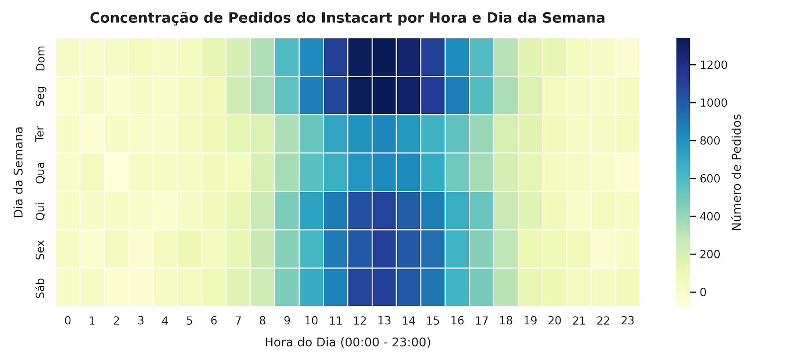
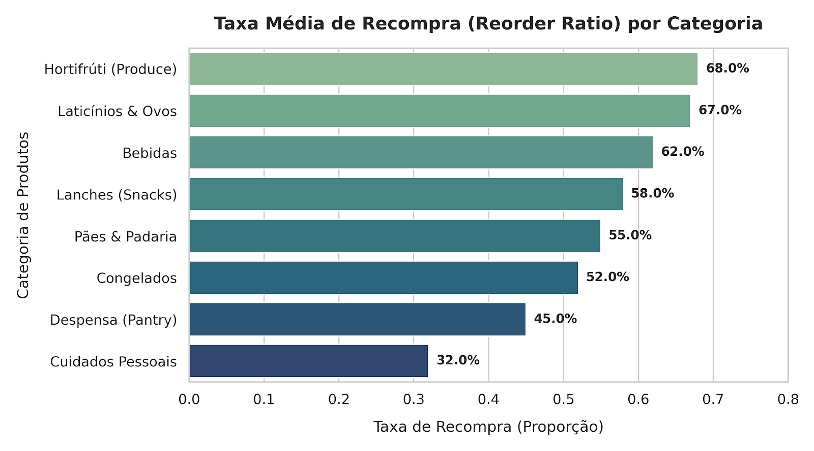
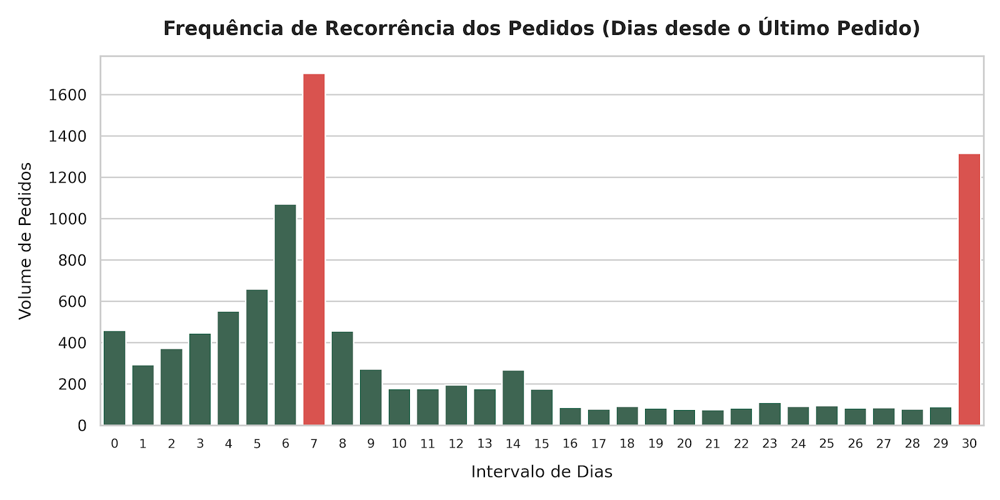

# 🛒 Instacart Order Analysis: Análise de Comportamento de Consumo

---

## 📌 Contexto & Objetivo
A Instacart é uma plataforma de entrega de supermercado. O objetivo deste projeto é realizar uma Análise Exploratória de Dados (EDA) e limpeza detalhada de grandes volumes de dados para compreender o perfil de compra dos clientes, hábitos de recompra e horários de maior pico de pedidos.

---

## 📊 Análise Visual & Principais Insights

- Identificação dos horários e dias de maior pico de pedidos para otimização de campanhas e alocação de entregadores.
- Análise de recorrência de compras para categorização de produtos com maior taxa de lealdade.

---

### 1. Concentração de Pedidos por Hora e Dia da Semana


* **Hipótese:** Os picos de uso do aplicativo ocorrem nos fins de semana durante o período da tarde.
* **Conclusão:** Os maiores volumes de pedidos concentram-se nos dias **0 e 1 (Domingo e Segunda-feira)**, entre **10:00 e 16:00**. Isso indica um forte comportamento de planejamento de compras da semana por parte das famílias.

---

### 2. Taxa de Recompra (Reorder Ratio) por Categoria


* **Hipótese:** Produtos perecíveis de consumo diário possuem taxas de recompra significativamente maiores que itens de higiene e limpeza.
* **Conclusão:** As categorias de **Hortifrúti (Produce)** e **Laticínios & Ovos** lideram com taxas de recompra superiores a **67%**, enquanto **Cuidados Pessoais** registra apenas 32%. Estratégias de fidelização e cupons devem priorizar produtos de alta rotatividade.

---

### 3. Recorrência e Ciclo de Compras do Cliente


* **Insight Chave:** O histograma revela dois picos claros de intervalo de pedidos: em **7 dias** (compras semanais de rotina) e em **30 dias** (reabastecimento mensal). O pico no dia 30 também reflete o limite máximo de truncamento dos dados da plataforma.

---

## 🔎 Metodologia & Etapas
1. **Tratamento e Preenchimento de Dados:** Identificação e tratamento de valores ausentes, remoção de duplicatas e conversão de tipos de dados.
2. **Análise Exploratória (EDA):**
   - Distribuição de pedidos por dia da semana e horário do dia.
   - Produtos mais populares e taxa de itens adicionados ao carrinho em primeiro lugar.
   - Média de tempo entre os pedidos por cliente.
3. **Geração de Insights de Negócio:** Mapeamento de oportunidades para estratégias de marketing e logística.

---

## 🛠️ Tecnologias e Ferramentas Utilizadas
- **Linguagem:** Python
- **Bibliotecas:** Pandas, NumPy, Matplotlib, Seaborn
- **Ambiente:** Jupyter Notebook

---

## 🚀 Como Executar o Projeto
1. Clone o repositório:
   ```bash
   git clone [https://github.com/derikpetiz/Instacart.git](https://github.com/derikpetiz/Instacart.git)
